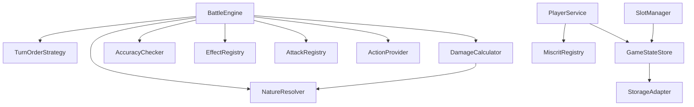

# TDD — Core Battle System (v1)

## 1. Purpose and scope

This document specifies the abstractions required to implement v1 of the Miscrits battle system. It defines components, contracts, and extension points. The implementation language is **Python 3.11+**.

**References PRD:** docs/features/core-battle-system/prd.md

### 1.1 In scope (v1)

- Miscrit and player domain model with template/instance split.
- Nature system with six natures and two elemental triangles.
- Attack catalog with pluggable effects.
- Combat orchestration (1v1) with three strategy seams: turn order, damage calculation, accuracy.
- ActionProvider interface for programmatic play (RL-ready).
- Structured battle log.
- Persistence behind a storage adapter (file-backed in v1).

### 1.2 Deferred to v2+

- Switching miscrits mid-battle (v2).
- Enchantments (v2).
- Leveling and grade-based stat growth (v2).
- Evolution (v2).
- Multi-miscrit team battles (v2).
- Capture, inventory, world (v3).
- RL training harness (v4).
- Multiplayer networking, UI (TBD).

### 1.3 Architectural principles

- **Composition over inheritance** — effects and strategies are composed in, not inherited.
- **Registries over subclassing** — new miscrits, attacks, and effects are registered, not coded into a hierarchy.
- **Strategy pattern** — for any algorithm the design expects to evolve (damage calc, turn order, accuracy).
- **Adapter pattern** — at I/O boundaries (storage).
- **Template/Instance separation** — per-species data is shared; per-creature state is isolated.

### 1.4 Language and tooling

- **Python 3.11+** — for `StrEnum`, improved type hints, `dataclass` features
- **dataclasses** — frozen for value types, mutable for runtime entities
- **enum.StrEnum** — string-serializable enums for JSON compatibility
- **abc.ABC + abstractmethod** — for interfaces (Effect, ActionProvider, StorageAdapter, strategies)
- **pytest + pytest-cov** — testing and coverage
- **mypy --strict** — type checking
- **No runtime dependencies beyond stdlib** for v1 (lean for RL training speed)

### 1.5 Project structure

```
src/miscrits_clone/
├── models/              # Domain entities and value types
│   ├── enums.py         # All enumerations + triangle constants
│   ├── value_types.py   # DamageResult, Slot, Action, TurnEntry, observations
│   ├── miscrit.py       # Miscrit template, MiscritInstance
│   ├── attack.py        # Attack data model
│   ├── effect.py        # Effect ABC
│   ├── player.py        # Player entity
│   └── battle.py        # Battle, BattleSide
├── registries/          # Global catalogs
│   ├── miscrit_registry.py
│   ├── attack_registry.py
│   └── effect_registry.py
├── engine/              # Combat subsystem
│   ├── battle_engine.py
│   ├── nature_resolver.py
│   ├── damage_calculator.py
│   ├── turn_order.py
│   ├── accuracy_checker.py
│   └── rng.py
├── effects/             # v1 effect implementations
│   ├── stat_buff.py, stat_debuff.py
│   ├── burn.py, regenerate.py
│   ├── poison.py, switch_curse.py
│   ├── negate.py, instant_heal.py
├── providers/           # ActionProvider implementations
│   ├── action_provider.py   # ABC
│   ├── random_provider.py
│   └── scripted_provider.py
├── services/            # Player, slots
│   ├── player_service.py
│   └── slot_manager.py
├── storage/             # Persistence layer
│   ├── storage_adapter.py   # ABC
│   ├── file_adapter.py
│   └── game_state_store.py
└── loader/
    └── data_loader.py

tests/
├── unit/                # One test file per component
└── integration/         # Cross-component tests (battle e2e, storage, loader)

data/
├── miscrits/            # Species JSON configs
└── attacks/             # Attack JSON configs
```

Each module maps to one component from the dependency map in §6.

---

## 2. Domain model

### 2.1 Enumerations

| Enum | Members | Notes |
|---|---|---|
| `Nature` | `NATURE, FIRE, WATER, EARTH, LIGHTNING, WIND` | The six elemental natures |
| `Stat` | `HP, SPD, PD, ED, PA, EA` | |
| `Grade` | `F, F_PLUS, E, E_PLUS, D, D_PLUS, C, C_PLUS, B, B_PLUS, A, A_PLUS, S, S_PLUS` | Per-instance quality. Affects stat growth in v2. Stored in v1 but not used for calculation. |
| `StatQuality` | `RED, WHITE, GREEN` | Per-stat quality within a grade. Red = slow growth, White = normal, Green = fast. |
| `Rarity` | `COMMON, UNCOMMON, RARE, EPIC, LEGENDARY` | Per-species encounter rarity. Separate concept from Grade. |
| `AttackType` | `PHYSICAL, ELEMENTAL` | Determines which attack/defense stat pair to use |
| `EffectTrigger` | `ON_APPLY, ON_TURN_START, ON_TURN_END, ON_HIT, ON_EXPIRE` | Lifecycle hooks |
| `TargetRule` | `SELF, SINGLE_OPPONENT` | v1 targets. `ALL_OPPONENTS` added in v2 with team battles. |
| `EffectCategory` | `STAT_BUFF, STAT_DEBUFF, DOT, HOT, FIXED_DOT, HEALING, DEFENSIVE` | Used for stacking rules — effects in the same category and targeting the same stat follow the same stacking logic. |

### 2.2 Nature matchup table

```
nature_advantage: Dict<Nature, Nature>  // maps nature -> the nature it beats

NATURE  beats WATER
WATER   beats FIRE
FIRE    beats NATURE
WIND    beats EARTH
EARTH   beats LIGHTNING
LIGHTNING beats WIND
```

**Matchup resolution:**

```
get_multiplier(attack_nature: Nature, defender_natures: List<Nature>) -> float:
    if attack is physical (nature is null): return 1.0

    for each defender_nature in defender_natures:
        if attack_nature beats defender_nature: return 2.0
        if defender_nature beats attack_nature: return 0.5

    return 1.0  // neutral (cross-triangle or same nature)
```

**Why this is simple:** The two triangles (Nature/Water/Fire and Wind/Earth/Lightning) are completely independent. A dual-natured miscrit always has one nature from each triangle, and an attack carries exactly one nature. The attack's nature can only interact with the defender's nature in the same triangle — the other nature is always cross-triangle (neutral). A "strong against one, weak against the other" scenario is impossible.

### 2.3 Entities

#### Miscrit (template / species)

Shared definition of a species. One per species, never tied to a player.

| Field | Type | Description |
|---|---|---|
| id | string | Unique species identifier |
| name | string | Species name |
| natures | List\<Nature\> | 1 or 2 natures. Single-natured miscrits have one entry. Dual-natured have two (one from each triangle). |
| rarity | Rarity | How rare the species is to encounter |
| base_stats | Map\<Stat, int\> | Base stat ratings (design's 1-5 scale). Used for growth calculations in v2. |
| movelist | List\<string\> | Attack IDs this species can use. Ordered. |

Exposes CRUD on its movelist (add / remove / replace attack references).

Does **not** define attacks inline or carry instance state.

#### MiscritInstance (owned creature)

A specific creature owned by a player.

| Field | Type | Description |
|---|---|---|
| id | string | Unique instance identifier |
| template_id | string | References Miscrit template |
| level | int | Current level (1-35). Set directly in v1. |
| grade | Grade | Instance quality. Stored in v1, affects growth in v2. |
| stat_qualities | Map\<Stat, StatQuality\> | Per-stat RED/WHITE/GREEN. Determines grade. |
| resolved_stats | Map\<Stat, int\> | Actual stat values used in battle. Set directly in v1. |
| current_hp | int | Current health. Starts equal to resolved HP. |
| active_effects | List\<EffectInstance\> | Currently attached effects with remaining duration and state. |

In v1, the instance inherits its template's movelist verbatim. Per-instance movelist overrides are v2.

#### Attack (data)

Pure data — no behavior. Stored in AttackRegistry.

| Field | Type | Description |
|---|---|---|
| id | string | Unique identifier |
| name | string | Display name |
| description | string | Flavor text |
| type | AttackType | PHYSICAL or ELEMENTAL |
| nature | Nature (nullable) | The elemental nature of the attack. Null for physical attacks. Must match one of the user miscrit's natures (enforced at registration time for movelist assignment, not at runtime). |
| power | int | AP term in damage formula |
| accuracy | int (0-100) | Hit chance |
| effect_ids | List\<string\> | Effects applied on hit |
| target_rule | TargetRule | Who the attack targets |

#### Effect (interface)

The pluggable behavior unit. Effects encode anything that isn't pure damage.

```
interface Effect:
    id: string
    name: string
    category: EffectCategory
    duration: int               // turns; 0 = instant
    triggers: Set<EffectTrigger>
    target_stat: Stat (nullable) // for buffs/debuffs — which stat is affected

    on_apply(target: MiscritInstance, context: EffectContext)
    on_turn_start(target: MiscritInstance, context: EffectContext)
    on_turn_end(target: MiscritInstance, context: EffectContext)
    on_hit(target: MiscritInstance, context: EffectContext)
    on_expire(target: MiscritInstance, context: EffectContext)
```

`EffectContext` provides:
- Reference to the source miscrit (the attacker who caused the effect).
- Reference to the battle state.
- The current round number.
- The effect's remaining duration.

Implementations override only the hooks they need; the rest are no-ops.

**Stacking contract:**

```
can_stack(existing: EffectInstance, incoming: Effect) -> StackAction:
    if existing.category != incoming.category: return APPLY_NEW
    if existing.target_stat != incoming.target_stat: return APPLY_NEW

    // Same category, same target stat:
    // STAT_BUFF, STAT_DEBUFF, FIXED_DOT: overwrite (refresh duration, replace magnitude)
    // DOT, HOT: TBD (open question)
    return OVERWRITE
```

`StackAction` is one of: `APPLY_NEW`, `OVERWRITE`, `REJECT`.

#### Player

| Field | Type | Description |
|---|---|---|
| id | string | Unique identifier |
| name | string | Display name |
| miscrit_instance_ids | List\<string\> | References to owned MiscritInstances |
| created_at | timestamp | |
| updated_at | timestamp | |

Slot assignments are managed by SlotManager, not the player entity.

#### Battle

Runtime container for a single fight.

| Field | Type | Description |
|---|---|---|
| id | string | Unique battle identifier |
| sides | List\<BattleSide\> | Exactly 2 sides |
| round_number | int | Current round |
| turn_log | List\<TurnEntry\> | Structured history of every action and outcome |
| status | ACTIVE, COMPLETED | |
| winner | BattleSide (nullable) | Set when status = COMPLETED |

`BattleSide` (v1):

| Field | Type | Description |
|---|---|---|
| player_id | string (nullable) | Null for AI/bot sides |
| active_miscrit | MiscritInstance | The one fighting miscrit in v1 |
| action_provider | ActionProvider | Who decides moves for this side |

---

## 3. Component architecture

### 3.1 Registries

Global catalogs populated at startup and queried at runtime.

**MiscritRegistry**

```
register(miscrit: Miscrit)
get(id: string) -> Miscrit
list(filter?) -> List<Miscrit>
```

**AttackRegistry**

```
register(attack: Attack)
get(id: string) -> Attack
list(filter?) -> List<Attack>
```

**EffectRegistry**

```
register(id: string, factory: (config?) -> Effect)
create(id: string) -> Effect
list() -> List<string>
```

Stores **factories**, not singletons — each application of an effect needs its own state (remaining duration, source reference, etc.).

### 3.2 Services

**PlayerService**

```
create_player(name) -> Player
get_player(id) -> Player
assign_miscrit(player_id, miscrit_template_id, stats, grade) -> MiscritInstance
```

In v1, `assign_miscrit` takes explicit stats and grade since there's no growth system.

**SlotManager**

Owns slot assignment rules. v1 uses a fixed-size active team (4 slots), though only one miscrit is used per battle in v1.

```
get_slots(player_id) -> List<Slot>
assign(player_id, slot_index, instance_id)
clear(player_id, slot_index)
```

`Slot`: index + optional MiscritInstance reference.

**NatureResolver**

Encapsulates the nature matchup table and multiplier logic.

```
get_multiplier(attack_nature: Nature?, defender_natures: List<Nature>) -> float
is_strong(attacker_nature: Nature, defender_nature: Nature) -> bool
is_weak(attacker_nature: Nature, defender_nature: Nature) -> bool
```

This is a stateless utility. It could be a static/module-level function or a small service — implementation's choice. The key contract is that nature matchup logic lives in exactly one place.

**GameStateStore (with StorageAdapter)**

```
interface StorageAdapter:
    save(entity_type: string, id: string, payload: bytes)
    load(entity_type: string, id: string) -> bytes
    delete(entity_type: string, id: string)
    list(entity_type: string) -> List<string>

class GameStateStore:
    save_player(player); load_player(id)
    save_miscrit_instance(instance); load_miscrit_instance(id)
    save_battle(battle); load_battle(id)
```

v1 ships a `FileStorageAdapter` (one file per entity, JSON payloads). Migrating to a database means implementing one new `StorageAdapter`.

### 3.3 Combat subsystem

#### ActionProvider (interface)

The contract between the battle engine and the decision-maker.

```
interface ActionProvider:
    choose_action(observation: BattleObservation) -> Action
```

**BattleObservation:**

| Field | Type | Description |
|---|---|---|
| own_miscrit | ObservedMiscrit | Full view of own miscrit |
| opponent_miscrit | OpponentObservation | Partial view of opponent |
| round_number | int | Current round |
| turn_log | List\<TurnEntry\> | History so far (same log both sides see) |

`ObservedMiscrit` (full info — own side):

| Field | Type | Description |
|---|---|---|
| template_id | string | Species |
| natures | List\<Nature\> | |
| current_hp | int | |
| max_hp | int | |
| resolved_stats | Map\<Stat, int\> | Current effective stats (after buffs/debuffs) |
| base_resolved_stats | Map\<Stat, int\> | Stats before any modifications |
| active_effects | List\<EffectSummary\> | |
| available_attacks | List\<Attack\> | Attacks this miscrit can use |

`OpponentObservation` (limited info — opponent side):

| Field | Type | Description |
|---|---|---|
| template_id | string | Species (always visible) |
| natures | List\<Nature\> | Always visible |
| current_hp | int | Visible |
| max_hp | int | Visible |
| active_effects | List\<EffectSummary\> | Visible effects only |
| stats_visible | bool | Whether opponent stats are shown. TBD — defaults to false in v1. |
| resolved_stats | Map\<Stat, int\> (nullable) | Only populated if stats_visible = true |

**Action (v1):**

```
Action:
    attack_id: string   // which attack to use
```

In v2, Action becomes a union: `AttackAction(attack_id)` | `SwitchAction(slot_index)`.

**v1 implementations:**

| Provider | Behavior | Use case |
|---|---|---|
| RandomActionProvider | Picks a random valid attack | Smoke testing, baseline opponent |
| ScriptedActionProvider | Follows a predefined move list, cycles if battle lasts longer | Deterministic tests, regression testing |

#### TurnOrderStrategy (interface)

```
interface TurnOrderStrategy:
    order(sides: List<BattleSide>, round_number: int, turn_log: List<TurnEntry>) -> List<BattleSide>
```

**Default implementation (SpeedBasedTurnOrder):**
- Compare active miscrits' effective SPD (after buffs/debuffs).
- Higher SPD goes first.
- Tie-breaking: random coin flip (seeded for reproducibility).

The `turn_log` parameter is exposed for future implementations that may use previous-round context (e.g., speed control rules in v2).

#### DamageCalculator (interface)

```
interface DamageCalculator:
    calculate(attacker: MiscritInstance,
              defender: MiscritInstance,
              attack: Attack,
              context: BattleContext) -> DamageResult
```

Reads:
- `A` — attacker's `PA` or `EA`, chosen by `attack.type`
- `D` — defender's matching defense (`PD` or `ED`)
- `AP` — `attack.power`
- `M` — nature multiplier from `NatureResolver.get_multiplier(attack.nature, defender.natures)`

`BattleContext` provides: round number, turn log, any battle-wide modifiers (e.g., Negate status on defender — removes elemental weakness, so multiplier is clamped to >= 1.0).

**DamageResult:**

| Field | Type | Description |
|---|---|---|
| raw_damage | int | Before nature multiplier |
| nature_multiplier | float | 0.5, 1.0, or 2.0 |
| final_damage | int | After multiplier, floored to int |
| was_negated | bool | True if Negate clamped the multiplier |

The exact formula for `raw_damage = f(A, D, AP)` is TBD (PRD open question #1). The default implementation will use a placeholder formula until the real one is reverse-engineered.

#### AccuracyChecker (interface)

```
interface AccuracyChecker:
    check(attack: Attack, attacker: MiscritInstance, defender: MiscritInstance, rng: RNG) -> bool
```

Default: `rng.random(0, 100) < attack.accuracy`. Extracted as an interface because accuracy modifiers (evasion buffs, accuracy debuffs) may be added later.

#### BattleEngine (orchestrator)

The round loop. Delegates every decision to strategy interfaces.

```
class BattleEngine:
    constructor(
        turn_order: TurnOrderStrategy,
        damage_calc: DamageCalculator,
        accuracy: AccuracyChecker,
        effect_registry: EffectRegistry,
        nature_resolver: NatureResolver,
        rng: RNG
    )

    run_battle(battle: Battle) -> BattleResult:
        while battle.status == ACTIVE:
            run_round(battle)
        return BattleResult(winner, turn_log)

    run_round(battle: Battle):
        ordered_sides = turn_order.order(battle.sides, battle.round_number, battle.turn_log)

        for side in ordered_sides:
            actor = side.active_miscrit
            if actor.current_hp <= 0: continue

            // 1. Turn start effects
            fire_effects(ON_TURN_START, actor)
            if actor.current_hp <= 0:
                log_faint(actor)
                check_win(battle)
                if battle.status == COMPLETED: return

            // 2. Choose and execute action
            observation = build_observation(battle, side)
            action = side.action_provider.choose_action(observation)
            attack = attack_registry.get(action.attack_id)

            hit = accuracy.check(attack, actor, opponent, rng)
            if hit:
                result = damage_calc.calculate(actor, opponent, attack, build_context(battle))
                opponent.current_hp -= result.final_damage
                log_damage(actor, opponent, attack, result)

                fire_effects(ON_HIT, opponent)

                for eid in attack.effect_ids:
                    target = resolve_target(attack.target_rule, actor, opponent)
                    apply_effect(eid, target, actor, battle)
            else:
                log_miss(actor, attack)

            // 3. Turn end effects
            fire_effects(ON_TURN_END, actor)

            // 4. Tick durations
            tick_and_expire_effects(actor)

            // 5. Faint check
            if opponent.current_hp <= 0:
                log_faint(opponent)
                check_win(battle)
                if battle.status == COMPLETED: return

        battle.round_number += 1

    apply_effect(effect_id, target, source, battle):
        incoming = effect_registry.create(effect_id)
        for existing in target.active_effects:
            stack_action = can_stack(existing, incoming)
            if stack_action == OVERWRITE:
                remove_effect(existing, target)  // fires ON_EXPIRE
                break
            if stack_action == REJECT:
                return
        incoming.source = source
        target.active_effects.add(incoming)
        incoming.on_apply(target, build_effect_context(battle, incoming))
```

**Key design decisions in the engine:**

1. **Effects can kill.** ON_TURN_START DOT can faint a miscrit before it acts. The engine checks HP after every effect trigger.
2. **Effect application respects stacking rules.** The `can_stack` function is called before applying any new effect.
3. **RNG is injected.** All randomness goes through a seeded RNG for reproducible battles (critical for testing and RL training).
4. **Turn log is append-only.** Every action, outcome, and state change is logged.

---

## 4. Extensibility

### 4.1 Adding a new miscrit species

1. Construct a `Miscrit` with unique id, name, nature(s), base_stats, rarity, and movelist (referencing existing attack IDs).
2. Call `MiscritRegistry.register(miscrit)`.
3. No engine changes.

### 4.2 Adding a new attack

1. Construct an `Attack` with unique id, type, nature, power, accuracy, effect_ids, target_rule.
2. Call `AttackRegistry.register(attack)`.
3. Add the attack's id to relevant miscrit movelists.
4. No engine changes.

### 4.3 Adding a new effect

1. Implement the `Effect` interface. Override only the hooks needed.
2. Register a factory: `EffectRegistry.register("new_effect", () -> new NewEffect())`.
3. Reference the effect's id from any attack's `effect_ids`.
4. No engine changes — the lifecycle hooks are already driven every turn.

**Examples of v1 effect implementations:**

| Effect | Hooks used | Behavior |
|---|---|---|
| StatBuff | on_apply, on_expire | on_apply: add magnitude to target's resolved stat. on_expire: subtract it back. |
| StatDebuff | on_apply, on_expire | on_apply: subtract magnitude from target's resolved stat. on_expire: add it back. |
| Burn (DOT) | on_turn_end | Calculate damage from source.EA vs target.ED (scaled down), apply to target. |
| Regenerate (HOT) | on_turn_end | Heal target by an amount derived from target's max HP. |
| Poison (fixed DOT) | on_turn_end | Subtract fixed damage from target HP. Ignores stats. |
| SwitchCurse | on_turn_end | Subtract `base_damage * turns_active` from target HP. Increments internal counter each turn. |
| Negate | on_apply | Sets a flag on the target that causes NatureResolver to clamp multiplier >= 1.0 for incoming attacks. Duration = until battle end (or switch in v2). |
| InstantHeal | on_apply | Add HP to target (capped at max HP). Duration = 0 (instant). |

### 4.4 Swapping a strategy

1. Implement the corresponding interface (TurnOrderStrategy, DamageCalculator, AccuracyChecker).
2. Inject the new implementation into BattleEngine at construction.
3. No other component needs to know.

### 4.5 Replacing the storage backend

1. Implement `StorageAdapter`.
2. Provide it to `GameStateStore` at startup.
3. No domain code changes.

---

## 5. Key data flows

### 5.1 Setting up a battle

```
// 1. Create miscrits
fire_sprite = MiscritRegistry.get("fire_sprite")
water_serpent = MiscritRegistry.get("water_serpent")

// 2. Create instances with explicit stats (v1)
instance_a = MiscritInstance(
    template_id="fire_sprite", level=10, grade=B,
    resolved_stats={HP:120, SPD:45, PA:30, EA:55, PD:25, ED:35}
)
instance_b = MiscritInstance(
    template_id="water_serpent", level=10, grade=A,
    resolved_stats={HP:110, SPD:50, PA:25, EA:60, PD:30, ED:40}
)

// 3. Create battle
battle = Battle(
    sides=[
        BattleSide(active_miscrit=instance_a, action_provider=RandomActionProvider(rng)),
        BattleSide(active_miscrit=instance_b, action_provider=ScriptedActionProvider(moves))
    ]
)

// 4. Run
result = engine.run_battle(battle)
// result.winner, result.turn_log available
```

### 5.2 One battle round

See `BattleEngine.run_round` in section 3.3. Summary:

1. TurnOrderStrategy determines who acts first (SPD comparison).
2. For each actor: fire ON_TURN_START effects -> get action from ActionProvider -> accuracy check -> damage calc (with nature multiplier from NatureResolver) -> apply damage -> fire ON_HIT -> apply attack effects (respecting stacking) -> fire ON_TURN_END -> tick durations -> check faint.
3. If neither fainted, increment round, repeat.

---

## 6. Component dependency map

| Component | Type | Owns | Depends on |
|---|---|---|---|
| MiscritRegistry | Registry | Miscrit templates | — |
| AttackRegistry | Registry | Attack definitions | — |
| EffectRegistry | Registry | Effect factories | — |
| NatureResolver | Utility | Matchup table | — |
| PlayerService | Service | Players | GameStateStore, MiscritRegistry |
| SlotManager | Service | Slot assignments | GameStateStore |
| GameStateStore | Service | Persistence facade | StorageAdapter |
| StorageAdapter | Adapter (interface) | Backend I/O | — |
| ActionProvider | Interface | Move selection | — |
| TurnOrderStrategy | Strategy (interface) | Turn order rule | — |
| DamageCalculator | Strategy (interface) | Damage formula | NatureResolver |
| AccuracyChecker | Strategy (interface) | Hit/miss rule | — |
| BattleEngine | Orchestrator | Round loop | TurnOrderStrategy, DamageCalculator, AccuracyChecker, EffectRegistry, NatureResolver, AttackRegistry |



---

## 7. Testing strategy

Every claim in this TDD has a corresponding test category.

| What | Type | What it verifies | How |
|---|---|---|---|
| Nature matchup table | Unit | All 36 nature pairs return correct multiplier | Parameterized test over all (attacker_nature, defender_nature) combos |
| Dual-nature matchup | Unit | Dual-natured defenders resolve correctly | Test fire attack vs (Water+Earth) defender, etc. |
| Negate interaction | Unit | Negate clamps multiplier >= 1.0 | Apply Negate to a water miscrit, hit with fire (normally 0.5x), verify 1.0x |
| DamageCalculator | Unit | Formula produces expected outputs | Known input/output pairs for physical and elemental paths |
| AccuracyChecker | Unit | Hits at expected rate | Statistical test: 10k rolls at accuracy=75, verify ~75% within tolerance |
| Effect lifecycle | Unit | Each v1 effect applies, ticks, and expires correctly | Per-effect tests: StatBuff modifies stat on apply, restores on expire; Poison deals fixed damage at turn end; etc. |
| Effect stacking | Unit | Same-category effects overwrite, not stack | Apply Poison twice, verify only one instance with refreshed duration |
| BattleEngine round | Integration | Full round executes correctly end-to-end | ScriptedActionProviders, seeded RNG, verify turn log matches expected sequence |
| Nature multiplier in battle | Integration | Elemental damage is 2x/0.5x in a real battle | Fire vs Water battle, verify logged damage includes 0.5x multiplier |
| DOT kills before action | Integration | A miscrit fainted by DOT at turn start does not act | Miscrit at 1 HP with Poison, verify it faints at ON_TURN_START and does not get an action |
| Battle completion | Integration | Battle ends when one miscrit faints, winner is set | Run full battle, verify status=COMPLETED and winner is correct |
| Deterministic replay | Integration | Same seed produces identical battle | Run same battle twice with same RNG seed, verify turn logs are identical |
| Storage round-trip | Integration | Save and load produce identical entities | Save a MiscritInstance, load it, verify all fields match |

---

## 8. Notes for v2 and beyond

- **Switching** — `Action` becomes a union type. BattleEngine's round loop adds a switch branch. BattleSide expands to hold a team of miscrits with one active. SlotManager becomes the authority on which miscrits are in the team.
- **Enchantments** — decorator around Attack or MiscritInstance that modifies power/accuracy/effects. The DamageCalculator and AccuracyChecker already receive the full attack object, so enchantments modify the object before it reaches them.
- **Leveling** — a `GrowthStrategy` derives resolved_stats from `(base_stats, level, grade, stat_qualities)`. Replaces direct stat assignment. The MiscritInstance contract doesn't change.
- **Grade in practice** — grade is derived from stat_qualities. All GREEN = S+, all RED = F. The mapping function is TBD.
- **RL agent** — implements ActionProvider. BattleObservation is already structured for this. Reward signal (win/loss, HP differential, etc.) is defined in the RL training harness, not in the battle engine.
- **Richer effects** — multi-hit, conditional triggers, on-kill bonuses are all implementable as new Effect registrations. No engine changes.

---

## 9. Open questions (inherited from PRD)

1. Exact damage formula `f(A, D, AP)`.
2. SPD tie-breaking rule.
3. Opponent stat visibility.
4. Stat-based DOT/HOT stacking.
5. Buff/debuff magnitude caps.
